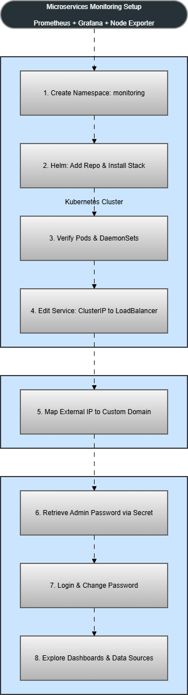
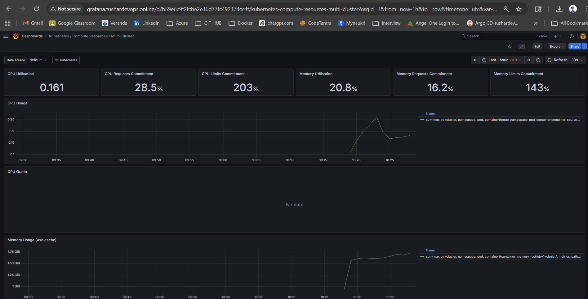
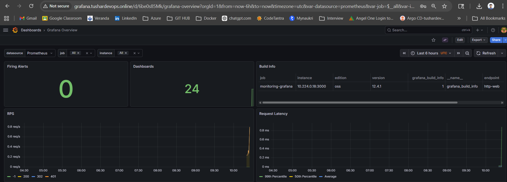
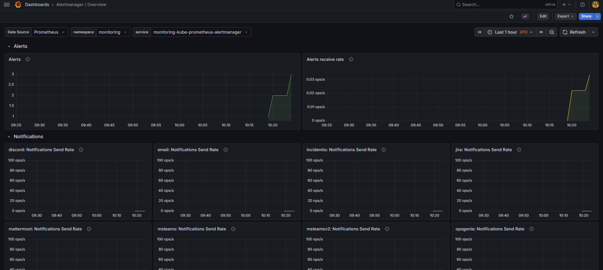
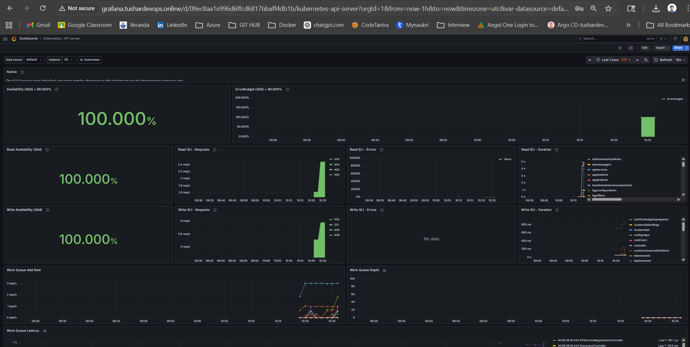
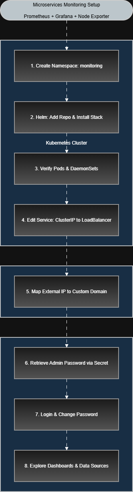

# Tushar_Microservice_Monitoring_Setup
This project sets up a complete **Kubernetes monitoring stack** using Prometheus, Grafana, and Node Exporter with external access via domain.

## 📊 Prometheus + Grafana + Node Exporter (Kubernetes_Single Cluster)
---

## 🧩 Architecture Overview

---

## ⚙️ Tech Stack

- Kubernetes
- Prometheus
- Grafana
- Node Exporter (DaemonSet)
- Helm

---

## 🚀 Step-by-Step Implementation

# 🚀 Kubernetes Monitoring Setup (Prometheus + Grafana)

### 1) Create Namespace

kubectl create namespace monitoring

---

### 2) Add Helm Repo & Install Monitoring Stack

helm repo add prometheus-community https://prometheus-community.github.io/helm-charts

helm repo update

helm install monitoring prometheus-community/kube-prometheus-stack -n monitoring

---

### 3) Verify Pods & DaemonSets

kubectl get pods -n monitoring  
kubectl get daemonsets -n monitoring

---

### 4) Check Services & Expose Grafana

kubectl get svc -n monitoring  

kubectl edit svc monitoring-grafana -n monitoring  

👉 Convert ClusterIP service to LoadBalancer:

type: LoadBalancer  

(AGIC ingress rule also can be used)

---

### 5) Map External IP to Custom Domain

Once External IP is assigned:

kubectl get svc -n monitoring  

👉 Map domain with IP (DNS):

grafana.tushardevops.online → <EXTERNAL-IP>  

👉 Access Grafana:

http://grafana.tushardevops.online/

---

### 6) Generate Grafana Admin Password

PowerShell command:

[System.Text.Encoding]::UTF8.GetString([System.Convert]::FromBase64String((kubectl get secret monitoring-grafana -n monitoring -o jsonpath="{.data.admin-password}")))

---

### 7) Login to Grafana

Username: admin  
Password: (generated above)  
update email address

👉 Change password after login

---

### 8) Explore Grafana

- Prometheus data source already configured  
- Node Exporter already configured  
- Dashboards available  

👉 Explore:
- Monitoring  
- Alerting  
- Metrics visualization  

---

## 📊 Commands Summary

kubectl get pods -n monitoring  
kubectl get daemonsets -n monitoring  
kubectl get svc -n monitoring  

---

## 🌐 Output Example

monitoring-grafana   LoadBalancer   10.x.x.x   20.xx.xx.xx   80:xxxxx/TCP  

---

## 🎯 Result

Grafana accessible via:

http://grafana.tushardevops.online/

---

## 🔥 Notes 

- Can use LoadBalancer OR Ingress (AGIC)  
- Prometheus + Node Exporter auto-configured  
- Ready-to-use monitoring dashboards

# Tushar_Microservice_Monitoring_Setup (Multi_Cluster)

sets up a **Multi-Cluster Kubernetes Monitoring Stack** using Prometheus, Grafana, Node Exporter, and Thanos for centralized monitoring and long-term storage.

---

## 📊 Prometheus + Grafana + Node Exporter + Thanos (Multi-Cluster)

---

## 🧩 Architecture Overview

---

## ⚙️ Tech Stack

- Kubernetes (Multi-Cluster)
- Prometheus (per cluster)
- Grafana (centralized)
- Node Exporter (DaemonSet)
- Thanos (multi-cluster aggregation)
- Helm
- Azure Blob Storage

---

# 🚀 Implementation Guide

---

## 🔹 STEP 1: Run in EACH Cluster

### 1) Create Namespace

kubectl create namespace monitoring

---

### 2) Add Helm Repo

helm repo add prometheus-community https://prometheus-community.github.io/helm-charts
helm repo update

---

### 3) Create Thanos Storage Secret

kubectl create secret generic thanos-objstore \
--from-literal=storage_account=<your_storage_account> \
--from-literal=storage_key=<your_storage_key> \
-n monitoring

---

### 4) Install Prometheus + Thanos Sidecar (Grafana Disabled)

helm install monitoring prometheus-community/kube-prometheus-stack \
-n monitoring \
--set grafana.enabled=false \
--set prometheus.prometheusSpec.thanos.objectStorageConfig.name=thanos-objstore \
--set prometheus.prometheusSpec.thanos.objectStorageConfig.key=storage_account \
--set prometheus.prometheusSpec.externalLabels.cluster="cluster-1"

👉 Repeat this in all clusters (change cluster name accordingly)

---

### 5) Verify Deployment

kubectl get pods -n monitoring
kubectl get daemonsets -n monitoring

---

### 6) (Optional) Expose Prometheus

kubectl edit svc monitoring-kube-prometheus-prometheus -n monitoring

Change:

type: LoadBalancer

---

## 🔹 STEP 2: Central Monitoring (One Cluster)

---

### 7) Install Grafana

helm install grafana prometheus-community/grafana -n monitoring

---

### 8) Expose Grafana

kubectl edit svc grafana -n monitoring

Change:

type: LoadBalancer

---

### 9) Map Domain

grafana.tushardevops.online → <GRAFANA-EXTERNAL-IP>

Access:

http://grafana.tushardevops.online/

---

### 10) Get Grafana Password

[System.Text.Encoding]::UTF8.GetString([System.Convert]::FromBase64String((kubectl get secret grafana -n monitoring -o jsonpath="{.data.admin-password}")))

---

### 11) Login to Grafana

Username: admin
Password: (generated above)

👉 Change password after login

---

## 🔹 STEP 3: Thanos Setup (Central Layer)

---

### 12) Deploy Thanos Query

apiVersion: apps/v1
kind: Deployment
metadata:
  name: thanos-query
  namespace: monitoring
spec:
  replicas: 1
  selector:
    matchLabels:
      app: thanos-query
  template:
    metadata:
      labels:
        app: thanos-query
    spec:
      containers:
      - name: thanos-query
        image: quay.io/thanos/thanos:v0.34.0
        args:
          - query
          - --store=dnssrv+_grpc._tcp.monitoring-kube-prometheus-prometheus.monitoring.svc.cluster.local
        ports:
        - containerPort: 9090

---

### 13) Expose Thanos Query

apiVersion: v1
kind: Service
metadata:
  name: thanos-query
  namespace: monitoring
spec:
  type: LoadBalancer
  selector:
    app: thanos-query
  ports:
    - port: 9090
      targetPort: 9090

---

### 14) Connect Grafana to Thanos

Grafana → Data Sources → Add Prometheus

Add:

http://<THANOS-QUERY-IP>:9090

---

## 📊 Commands Summary

kubectl get pods -n monitoring
kubectl get daemonsets -n monitoring
kubectl get svc -n monitoring

---

## 🌐 Output Example

grafana   LoadBalancer   10.x.x.x   20.xx.xx.xx   80:xxxxx/TCP

---

## 🎯 Result

- Single Grafana dashboard
- Multiple cluster metrics
- Centralized monitoring
- Long-term storage using Azure Blob

Access:

http://grafana.tushardevops.online/

---

## 🏗️ Architecture Flow

Clusters → Prometheus + Thanos Sidecar → Azure Blob Storage → Thanos Query → Grafana

---

## 🔥 Notes

- Each cluster runs only Prometheus (Grafana disabled)
- Central Grafana connects to Thanos
- Thanos enables multi-cluster monitoring
- Use LoadBalancer or Ingress (AGIC)

---

## ⚡ Production Recommendations

- Use Ingress + TLS (cert-manager)
- Avoid public Prometheus exposure
- Use private networking (VNet)
- Deploy Thanos Store Gateway & Compactor
- Configure Alertmanager (Slack / Email)

---

## 📊 Dashboards

---

## 👨‍💻 Author

Tushar Upase  
DevOps Engineer | Azure | Terraform | Kubernetes  

---

## ⭐ Support

If you found this useful, give this repo a ⭐ and share it 🚀
